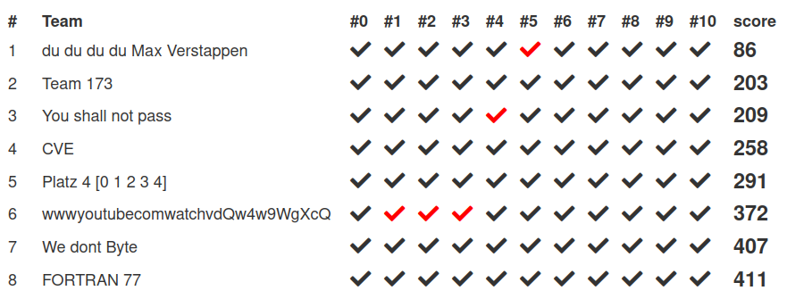

displays the actual scores in the scoreboard (ie the sum of the positions all submissions have)

for example a team has done two exercises. They were the first one to hand in the flag in the first exercise and the 68th one to hand in the flag for the second one then their overall score is (1+68=) 69

> [!NOTE]
> NOT a correct representation fo how the scores work under the hood. The scores displayed here gibe incomplete exercises a score of zero, the scoreboard gibes them a score of 9999

# Installation

> [!NOTE]
> With installing you're basically giving the code permission to be executed in your browser. I suggest you take a look before installing.

to install either 
- [install from file](https://extensionworkshop.com/documentation/publish/distribute-sideloading/#install-addon-from-file) with the `*.xpi` from the realease in the sidebar
- just click the `*.xpi` file in the release. This should just ask to install the addon

